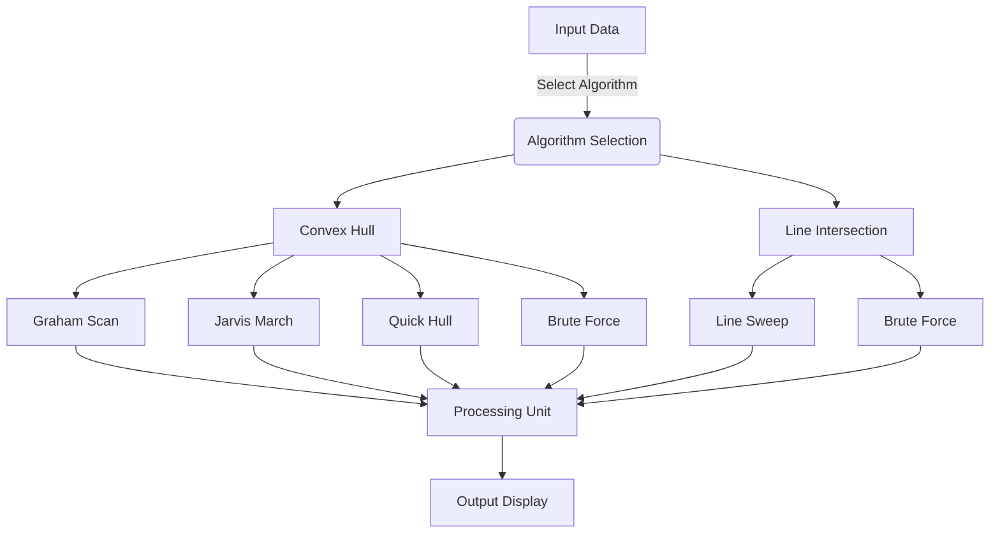

```mermaid
graph TD
    A[Input Data] -->|Select Algorithm| B(Algorithm Selection)
    B --> C[Convex Hull]
    B --> L[Line Intersection]
    C --> J[Jarvis March]
    C --> D[Graham Scan]
    C --> E[Quick Hull]
    C --> F[Brute Force]
    L --> G[Line Sweep]
    L --> BF[Brute Force]
    D --> H[Processing Unit]
    J --> H
    E --> H
    F --> H
    G --> H
    BF --> H
    H --> I[Output Display]
 
```